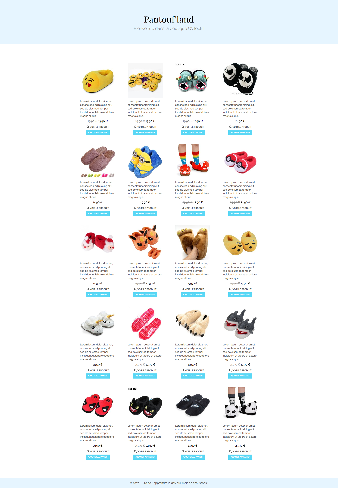
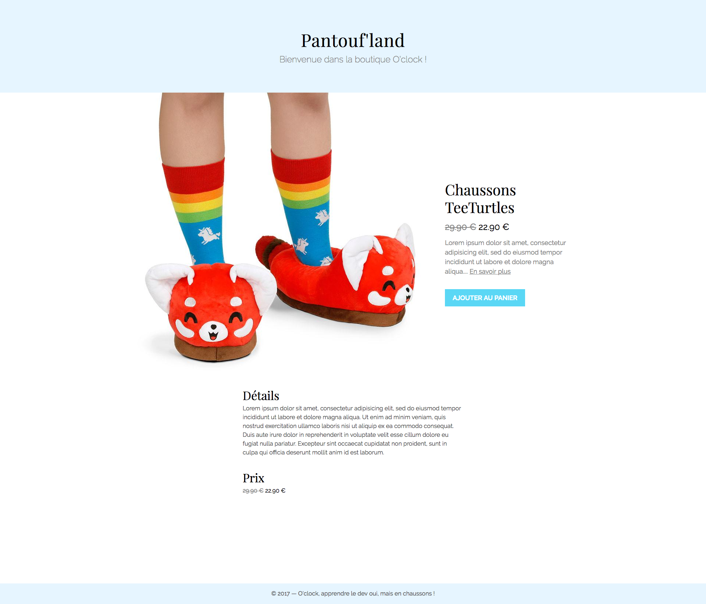

# Challenge : La boutique en PHP

## Objectif

Pendant les deux premières semaines, on a appris à faire du HTML / CSS, puis à la
3e semaine, on a attaqué PHP. Il est temps de tout mettre en commun pour se faire une boutique dynamique !

En cours, on a commencé à faire le PHP pour le listing produit et pour la fiche produit. Mais c'est horriblement moche :scream:  
CSS, nous voilà !


## Instructions

* Il faut réaliser l'intégration de ces pages en HTML / CSS :



* Quelques détails à savoir :
	- Il doit y avoir un lien sur l'image  
	Au passage de la souris sur ce lien, le titre doit apparaître avec un effet de fondu.
	La couleur du fond de ce titre doit laisser entrevoir le produit.

* On va rajouter à notre **reset.css** ou **normalize.css** la chose suivante :

```css
* {
	box-sizing: border-box;
}
```

Ça va nous permettre de modifier le comportement par défaut du calcul de la taille
de nos élements. Avec ça, les `width` et `height` incluent désormais le padding
et la bordure !


## A utiliser

### Google Fonts

- Playfair Display
- Raleway : 200, 400, 600

### Couleurs

- Texte : `#555`
- Header et footer : `rgb(230, 245, 255)`
- Titre : `#000`
- Sous-titre : `#888`
- Couleur des titres produits : `rgb(230, 245, 255)` (à un détail près…)
- Titre produit : `#000`
- Prix produit : `#000`
- prix barré : `#888`
- Voir le produit : `#555`
- Bouton produit couleur de texte : `#fff`
- Bouton produit couleur de fond : `rgb(90, 215, 245)`
- Bouton produit couleur de fond au survol : `rgb(100, 230, 240)`


## Whaaat ?!

Et oui, quelques nouveautés CSS !

Voyons voir :
* https://developer.mozilla.org/fr/docs/Web/CSS/opacity
* [https://developer.mozilla.org/fr/docs/Web/CSS/Type_color#rgba
* https://developer.mozilla.org/fr/docs/Web/CSS/box-sizing

## Bonus

- On peut utiliser [font awesome](http://fontawesome.io/) pour la loupe sur la page listing.

- Au hover sur le lien "voir le produit", la loupe doit devenir `rgb(100, 230, 240)`.

- Et dernier bonus… Faire la page produit !

